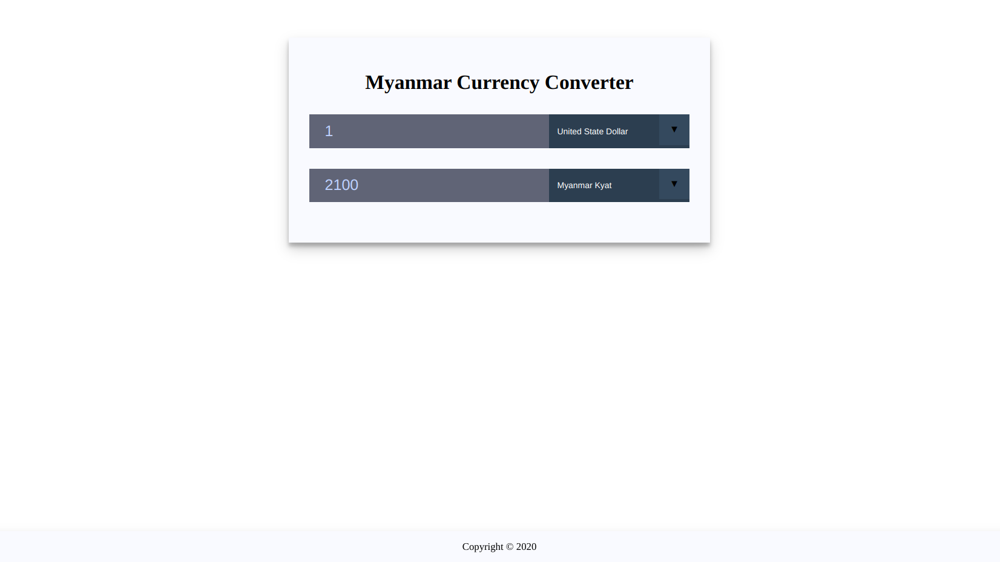

# Myanmar Currency Converter with React

The project is currency converter base on Myanmar Kyat currency. API is used from Central Bank of Myanmar to get Information about Currencies Exchange Rate.

## List of Countries Include

- United State Dollar
- Euro
- Singapore Dollar
- Pound Sterling
- Swiss Franc
- Japanese Yen
- Australian Dollar
- Bangladesh Taka
- Brunei Dollar
- Cambodian Riel
- Canadian Dollar
- Chinese Yuan
- Hong Kong Dollar
- Indian Rupee
- Indonesian Rupiah
- Korean Won
- Lao Kip
- Malaysian Ringgit
- New Zealand Dollar
- Pakistani Rupee
- Philippines Peso
- Sri Lankan Rupee
- Thai Baht
- Vietnamese Dong
- Brazilian Real
- Czech Koruna
- Danish Krone
- Egyptian Pound
- Israeli Shekel
- Kenya Shilling
- Kuwaiti Dinar
- Nepalese Rupee
- Norwegian Kroner
- Russian Rouble
- Saudi Arabian Riyal
- Serbian Dinar
- South Africa Rand
- Swedish Kron
